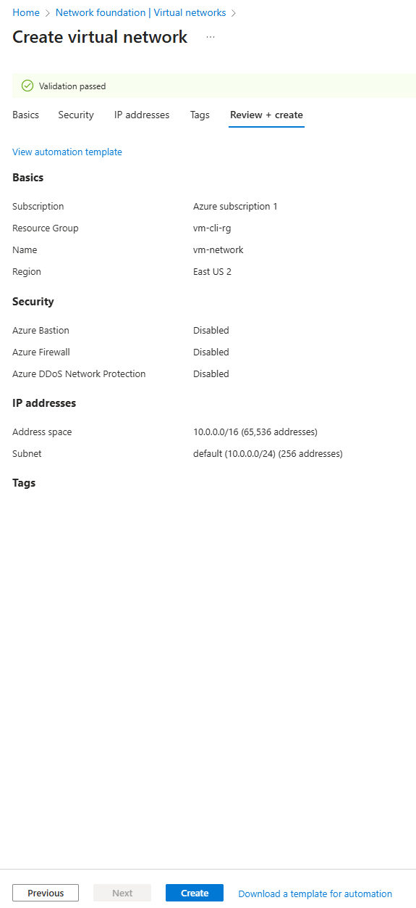
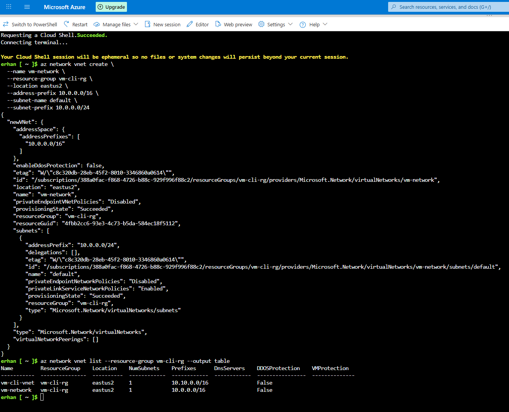

# 04 – Create a Virtual Network (VNet)

## Objective
Create a Virtual Network (VNet) that provides a secure, isolated environment for my virtual machine (`vm-cli-01`).  
A VNet acts like a private data center inside Azure — I control the IP ranges, subnets, and traffic rules.

---

## Option 1 – Using the Azure Portal (GUI)

### 1) Navigate to **Virtual networks**
- Open the **Azure Portal**
- Search for **Virtual networks**
- Click **Create**

### 2) Basics
| Setting | Value |
|---|---|
| **Subscription** | Azure subscription 1 |
| **Resource Group** | `vm-cli-rg` |
| **Name** | `vm-network` |
| **Region** | **East US 2** |


### 3) IP Addresses
| Setting | Value |
|---|---|
| **IPv4 address space** | `10.0.0.0/16` |
| **Subnet name** | `default` |
| **Subnet range** | `10.0.0.0/24` |

> [!WARNING]  
> If you see an overlapping address space warning, choose a unique CIDR (for example `10.1.0.0/16`) so it won’t conflict with on-prem or other VNets.


### 4) Security & Tags
Leave the following **unchecked** for this basic setup (you can add them later if needed):
- Virtual network encryption  
- Azure Bastion  
- Azure Firewall  
- Azure DDoS Protection

### 5) Review + Create
- Click **Review + create** → verify **Validation passed**  
- Click **Create**



### 6) Deployment Complete
When deployment finishes, you’ll see the confirmation page.


---

## Option 2 – Using Azure CLI (Cloud Shell or Local)

Run the following commands to create the same VNet and default subnet via CLI:

```bash
az network vnet create \
  --name vm-network \
  --resource-group vm-cli-rg \
  --location eastus2 \
  --address-prefix 10.0.0.0/16 \
  --subnet-name default \
  --subnet-prefix 10.0.0.0/24
```

Verify via CLI
az network vnet list --resource-group vm-cli-rg --output table


