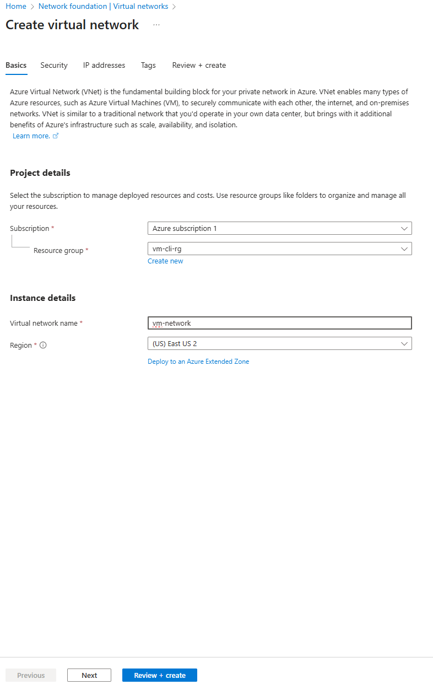
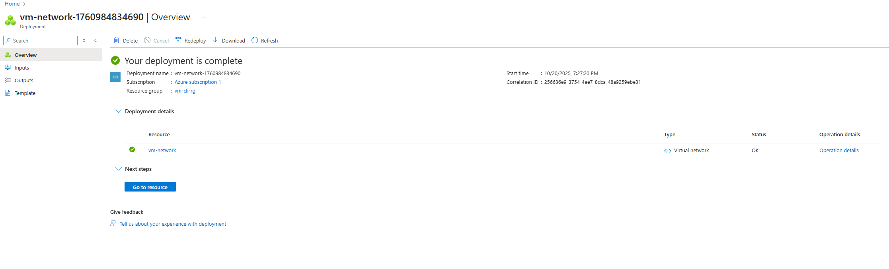

Create a Virtual Network (VNet)

Objective

Create a Virtual Network (VNet) that provides a secure, isolated environment for my virtual machine (vm-cli-01).
A VNet acts like my private data center inside Azure — control its IP ranges, subnets, and traffic rules.

Option 1 — Using Azure Portal (GUI)
1️Navigate to Virtual Networks

Go to the Azure Portal

Search for Virtual networks

1.Click Create

2️.Fill in the “Basics” tab
Setting	Value
Subscription	Azure subscription 1
Resource Group	vm-cli-rg
Name	vm-network
Region	East US 2

3️.Configure the “IP Addresses” tab
Setting	Value
IPv4 Address Space	10.0.0.0/16
Subnet Name	default
Subnet Range	10.0.0.0/24

⚠️ If you see a message about overlapping address spaces, use a unique range (e.g., 10.1.0.0/16).

4️.Security & Tags

Leave the following unchecked:

Virtual network encryption

Azure Bastion

Azure Firewall

Azure DDoS Protection

These are optional paid services and not needed for basic setups.

5. Review + Create

Click Review + Create → ensure validation passes 
Then click Create.

6️.Deployment Complete

Once deployment finishes, you’ll see the confirmation page.

Option 2 — Using Azure CLI (Cloud Shell or Local)

If you prefer scripting or automation, use the following command:

az network vnet create \
  --name vm-network \
  --resource-group vm-cli-rg \
  --location eastus2 \
  --address-prefix 10.0.0.0/16 \
  --subnet-name default \
  --subnet-prefix 10.0.0.0/24

Verify via CLI
az network vnet list --resource-group vm-cli-rg --output table

