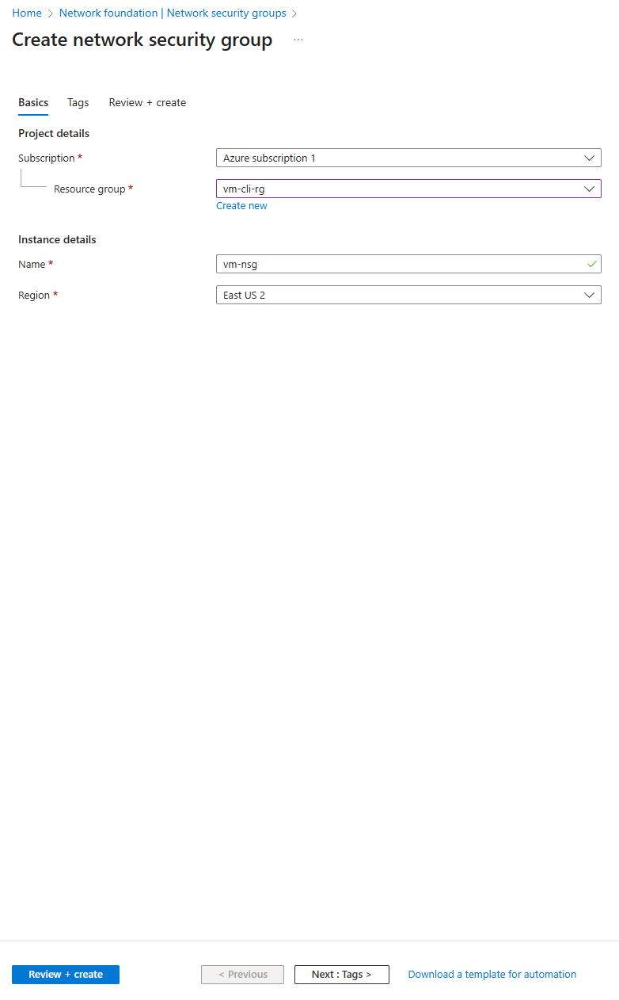
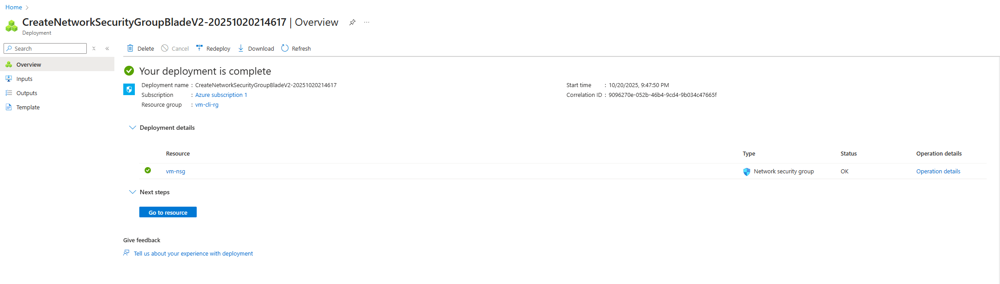
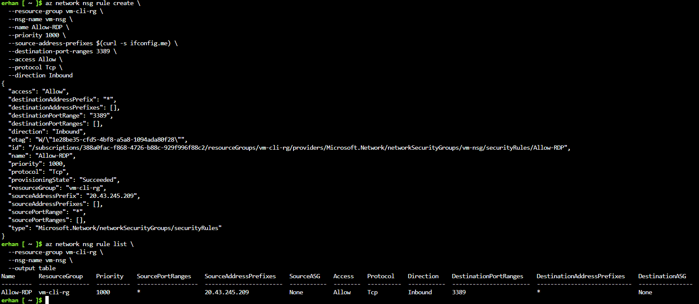

# 05 - Create a Network Security Group (NSG)

## Objective

Create a Network Security Group (NSG) that controls inbound and outbound traffic to mine virtual machine (VM).  
An NSG acts as a firewall, allowing or denying network traffic to resources connected to Azure Virtual Networks.

---

## Option 1 — Using Azure Portal (GUI)

### 1️.Navigate to Network Security Groups
- Go to the **Azure Portal**
- Search for **Network Security Groups**
- Click **Create**

### 2️.Fill in the “Basics” tab

| Setting         | Value               |
|-----------------|---------------------|
| Subscription     | Azure subscription 1 |
| Resource Group   | vm-cli-rg |
| Name             | vm-nsg |
| Region           | East US 2 |



---

### 3️.Review + Create

Click **Review + Create** → Ensure validation passes   
Then click **Create**.



---

### 4️.Add Inbound Rule for RDP Access (if needed)

Once the NSG is created, open it and add an inbound rule to allow RDP access from **your public IP** only.

| Name      | Priority | Port | Protocol | Source      | Action |
|------------|-----------|------|-----------|--------------|---------|
| Allow-RDP | 1000      | 3389 | TCP       | Your IP      | Allow  |


---

## Option 2 — Using Azure CLI (Cloud Shell or Local)

I also automate the process using Azure CLI.

### Step 1: Create the NSG
```bash
az network nsg create \
  --resource-group vm-cli-rg \
  --name vm-nsg \
  --location eastus2
```
Step 2: Add the RDP Rule (automatically detect your public IP)

```bash
MY_PUBLIC_IP=$(curl -s ifconfig.me)

az network nsg rule create \
  --resource-group vm-cli-rg \
  --nsg-name vm-nsg \
  --name Allow-RDP \
  --priority 1000 \
  --source-address-prefixes $MY_PUBLIC_IP \
  --destination-port-ranges 3389 \
  --access Allow \
  --protocol Tcp \
  --direction Inbound
```

Step 3: Verify NSG and Rules

```bash
az network nsg rule list \
  --resource-group vm-cli-rg \
  --nsg-name vm-nsg \
  --output table
Expected output will list your Allow-RDP rule with your public IP address.
```

