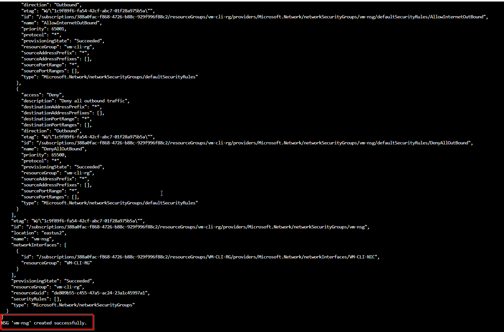
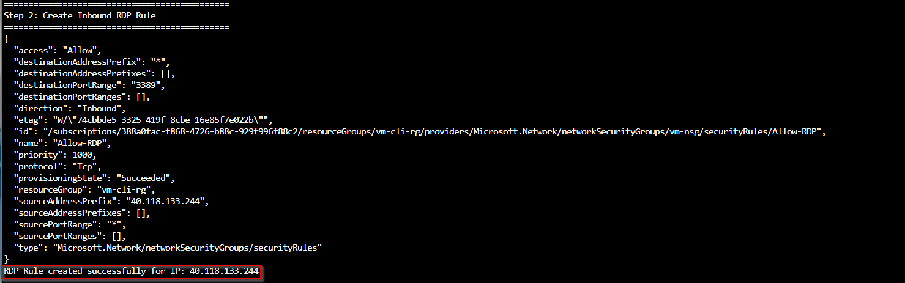
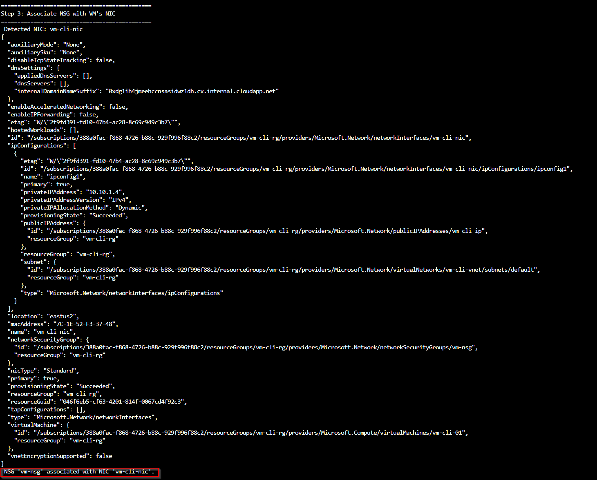
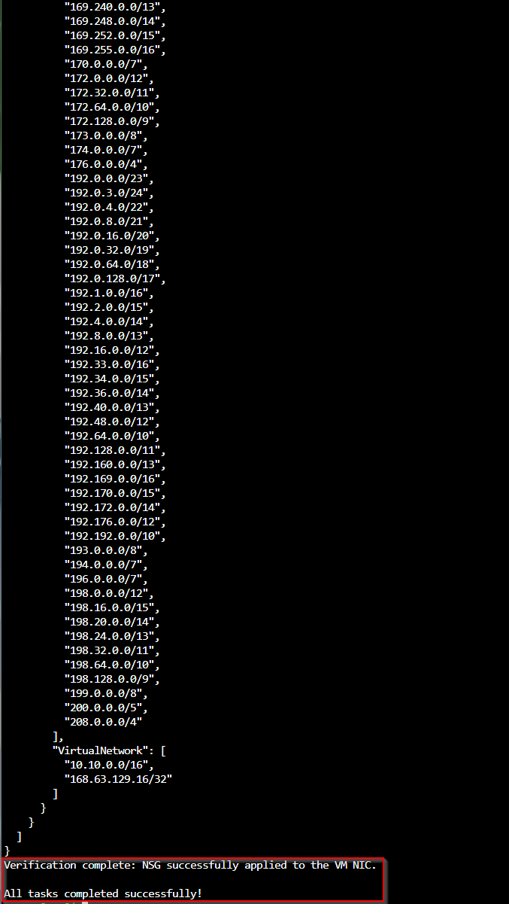

# Associate Network Security Group (NSG) with Virtual Machine

## Objective
In this section, you will create a Network Security Group (NSG), configure inbound RDP access, associate it with the virtual machine’s network interface (NIC), and verify the applied rules.

---

## Option 1 – Using Azure CLI

### 1️. Create a Network Security Group (NSG)

Run the following command to create an NSG in your existing resource group:

```bash
az network nsg create \
  --resource-group vm-cli-rg \
  --name vm-nsg \
  --location eastus2
```
Output confirms NSG creation:



### 2️. Create an Inbound RDP Rule

Allow RDP (TCP port 3389) only from your public IP for secure remote access.

```bash
MY_PUBLIC_IP=$(curl -s ifconfig.me)

az network nsg rule create \
  --resource-group vm-cli-rg \
  --nsg-name vm-nsg \
  --name Allow-RDP \
  --priority 1000 \
  --source-address-prefixes $MY_PUBLIC_IP \
  --destination-port-ranges 3389 \
  --access Allow \
  --protocol Tcp \
  --direction Inbound
```

Output confirmation:

RDP Rule created successfully for IP: <your-public-ip>



3️. Associate the NSG with the VM’s NIC

First, find your VM’s NIC name:

```bash
az network nic list \
  --resource-group vm-cli-rg \
  -o table
```

Then associate the NSG:

```bash
az network nic update \
  --name vm-cli-nic \
  --resource-group vm-cli-rg \
  --network-security-group vm-nsg
```

Confirmation message:

NSG 'vm-nsg' associated with NIC 'vm-cli-nic'



4️. Verify Effective NSG Rules

Confirm the NSG and rules are successfully applied to your VM’s NIC:

```bash
az network nic list-effective-nsg \
  --name vm-cli-nic \
  --resource-group vm-cli-rg \
  -o json
```

Output shows effective rules including:

Custom Allow-RDP

Default Azure rules (AllowVnetInBound, DenyAllInBound)


