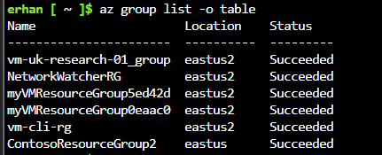
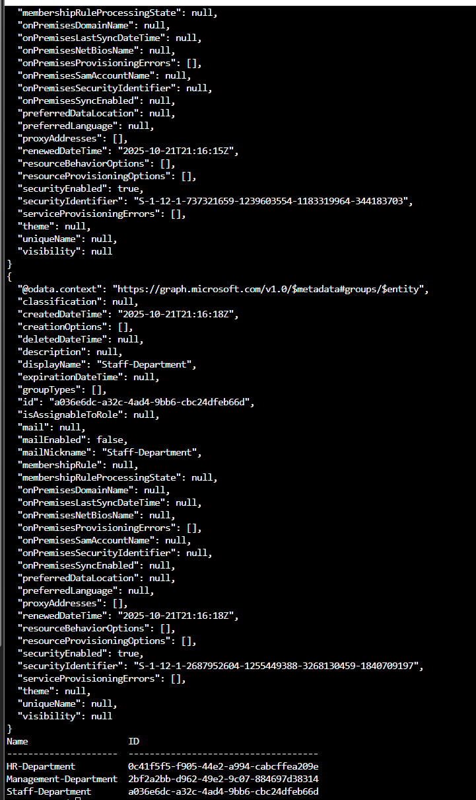
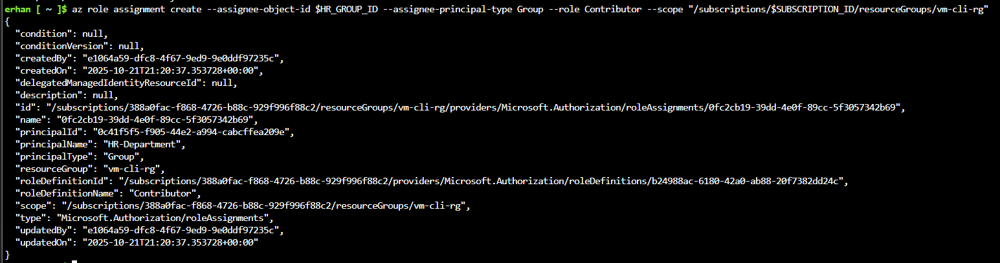
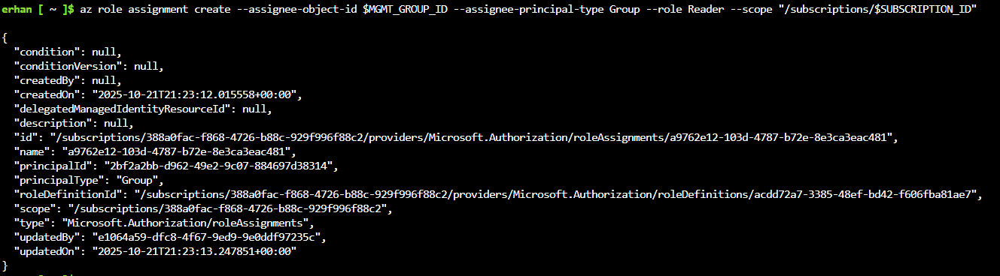
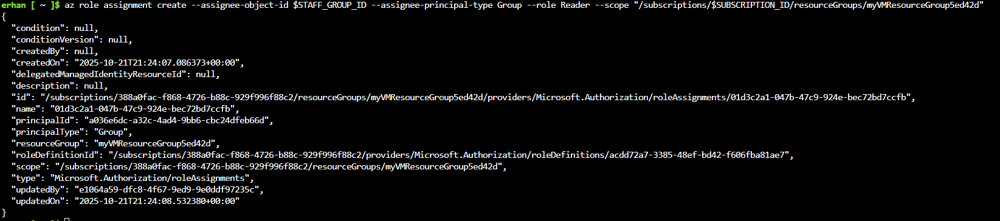
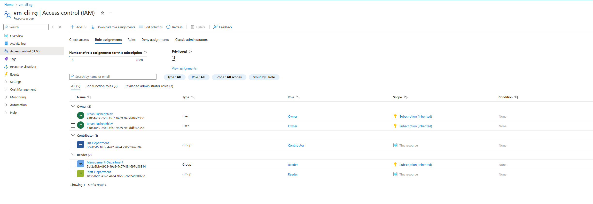

# Configure Role-Based Access Control (RBAC) for vm-cli-rg

## Objective

In this step, I configure **Azure Role-Based Access Control (RBAC)** to implement a **least-privilege model**.  
Each department (HR, Management, and Staff) will get access appropriate to their responsibilities.

I will:
- Create Azure AD groups for each department.
- Assign built-in Azure roles (`Contributor`, `Reader`) at specific scopes.
- Verify assignments in the Azure Portal.

---

## 1. List existing resource groups

I start by confirming the resource groups that exist in the subscription.

```bash
az group list -o table
```


## 2. Create department groups in Entra ID (Azure AD)

I create one Azure AD security group per department.

```bash
az ad group create --display-name "HR-Department" --mail-nickname "HR-Department"
az ad group create --display-name "Management-Department" --mail-nickname "Management-Department"
az ad group create --display-name "Staff-Department" --mail-nickname "Staff-Department"

# List all groups to capture their IDs
az ad group list -o table
```


## 3. Assign RBAC roles

We assign each group the correct Azure built-in role at the proper scope.

## 3.1 HR Department – Contributor on vm-cli-rg

The HR department needs to manage resources in vm-cli-rg.
I grant Contributor access to the HR group at the resource group level.

```bash
SUBSCRIPTION_ID=$(az account show --query id -o tsv)
HR_GROUP_ID="0c41f5f5-f905-44e2-a994-cabcffea209e"

az role assignment create \
  --assignee-object-id $HR_GROUP_ID \
  --assignee-principal-type Group \
  --role Contributor \
  --scope "/subscriptions/$SUBSCRIPTION_ID/resourceGroups/vm-cli-rg"
```


Result:

Scope: vm-cli-rg
Role: Contributor
Principal: HR-Department

## 3.2 Management Department – Reader at Subscription Level

Management only needs read-only access to view all resources.
I grant Reader access at the subscription level.

```bash
MGMT_GROUP_ID="2bf2a2bb-d962-49e2-9c07-884697d38314"

az role assignment create \
  --assignee-object-id $MGMT_GROUP_ID \
  --assignee-principal-type Group \
  --role Reader \
  --scope "/subscriptions/$SUBSCRIPTION_ID"
```


## 3.3 Staff Department – Reader on myVMResourceGroup5ed42d

The Staff department only needs to view resources in a specific resource group.
I grant Reader access scoped to myVMResourceGroup5ed42d.

```bash
STAFF_GROUP_ID="a036e6dc-a32c-4ad4-9bb6-cbc24dfeb66d"

az role assignment create \
  --assignee-object-id $STAFF_GROUP_ID \
  --assignee-principal-type Group \
  --role Reader \
  --scope "/subscriptions/$SUBSCRIPTION_ID/resourceGroups/myVMResourceGroup5ed42d"
```


Result:

Scope: myVMResourceGroup5ed42d
Role: Reader
Principal: Staff-Department

## 4. Verify role assignments in the Azure Portal

- Once the roles are assigned, I verify them in Access control (IAM).
- Open the Azure Portal → Resource groups → select vm-cli-rg.
- Navigate to Access control (IAM) → Role assignments.

Review the listed groups, roles, and scopes.

Expected view:

| Principal             | Type  | Role        | Scope                    |
| --------------------- | ----- | ----------- | ------------------------ |
| HR-Department         | Group | Contributor | This resource            |
| Management-Department | Group | Reader      | Subscription (Inherited) |
| Staff-Department      | Group | Reader      | This resource            |


This confirms the assignments were successfully applied and scoped correctly.



