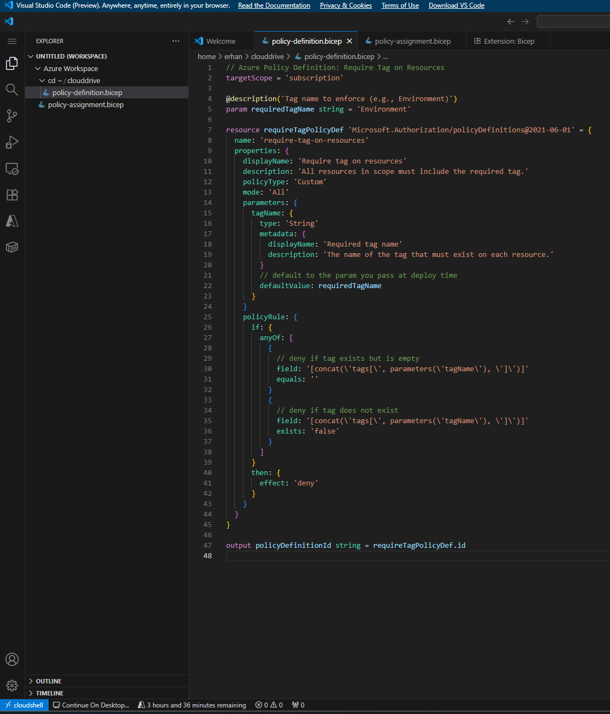
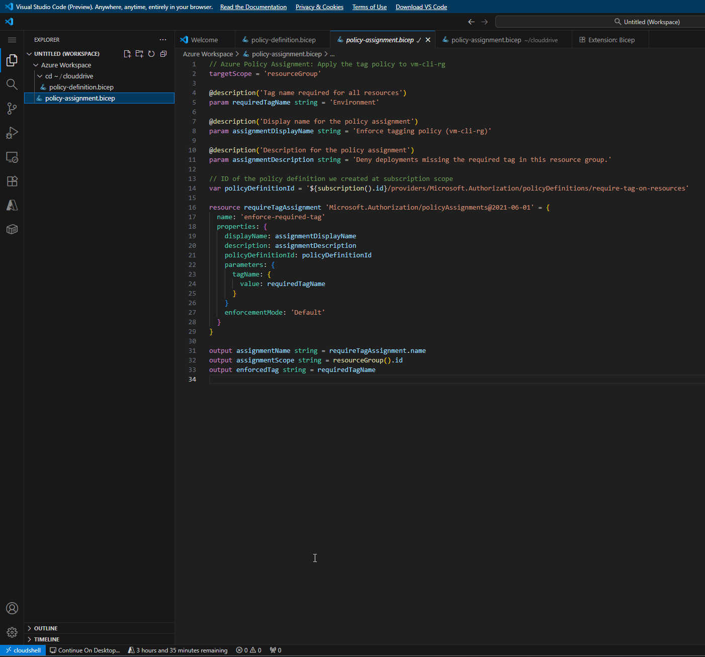
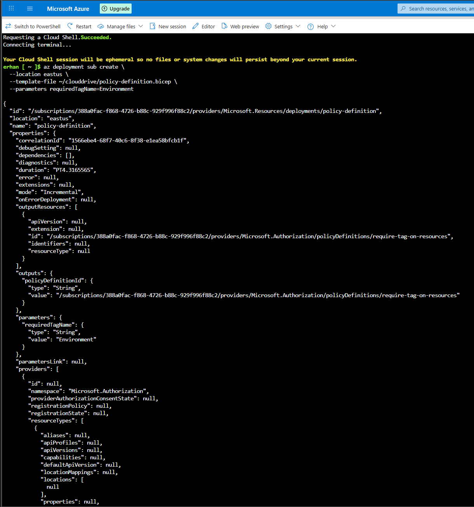
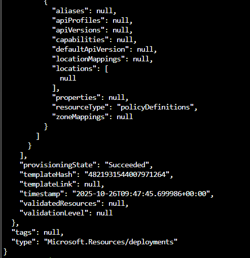
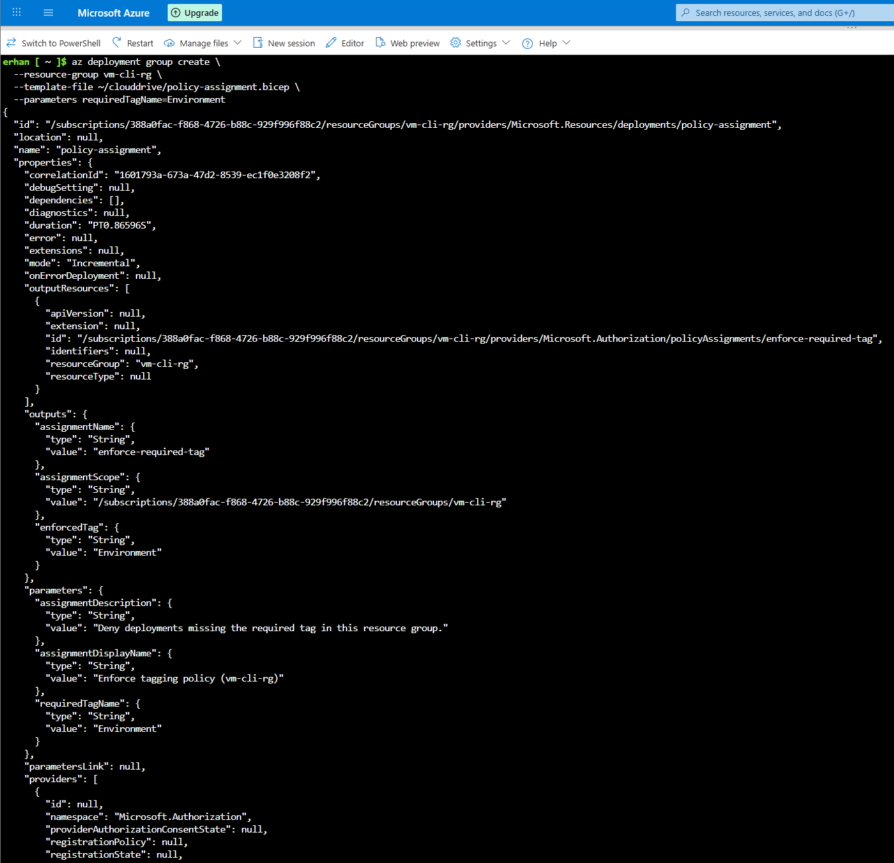
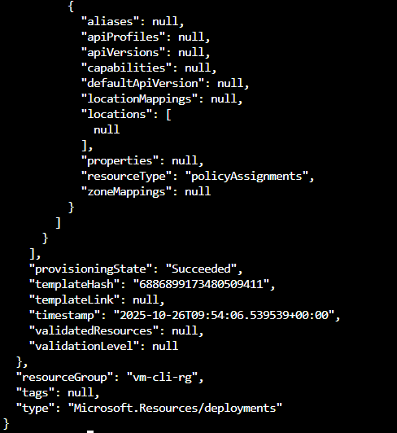
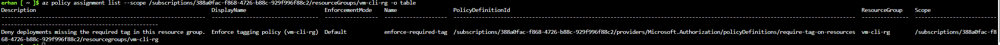
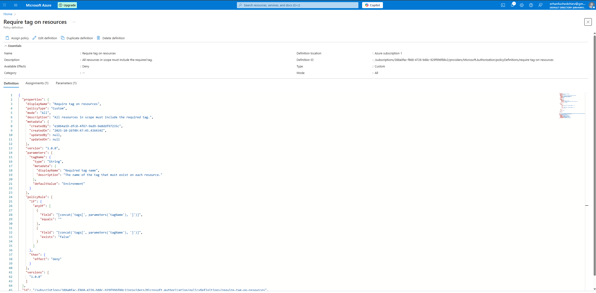
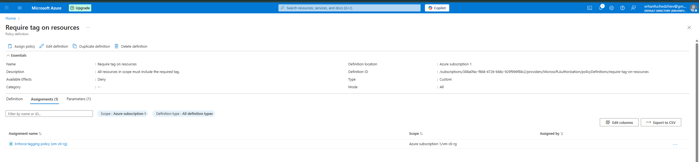

# 08 – Enforce Required Tag Policy on Resource Group (Azure Policy + Bicep)

## Goal

I want to enforce governance on our migration landing zone:
**every resource deployed in the target resource group must include a specific tag**  
(e.g. `Environment`).  
If someone tries to deploy without that tag, Azure will *deny* the deployment.

I implement this with Azure Policy using Infrastructure-as-Code (Bicep) and Azure CLI.

This is part of the cloud governance story for the vm-cli-rg resource group used in the migration case study.


---

## High-level flow

1. **Create a custom Policy Definition** at the subscription scope  
   - Name: `require-tag-on-resources`  
   - Effect: `Deny`  
   - Purpose: block any resource missing a required tag

2. **Assign that policy to a specific resource group**  
   - Assignment name: `enforce-required-tag`  
   - Scope: `vm-cli-rg`  
   - Tag enforced: `Environment`

3. **Verify**:
   - The policy definition exists in the subscription
   - The assignment is active on the `vm-cli-rg`
   - Azure Portal shows both


---

## Bicep: Policy Definition (subscription scope)

File: `scripts/07-policy-definition.bicep`

```bicep
targetScope = 'subscription'

@description('Tag name to enforce (e.g., Environment)')
param requiredTagName string = 'Environment'

resource requireTagPolicyDef 'Microsoft.Authorization/policyDefinitions@2021-06-01' = {
  name: 'require-tag-on-resources'
  properties: {
    displayName: 'Require tag on resources'
    description: 'All resources in scope must include the required tag.'
    policyType: 'Custom'
    mode: 'All'
    parameters: {
      tagName: {
        type: 'String'
        metadata: {
          displayName: 'Required tag name'
          description: 'The name of the tag that must exist on each resource.'
        }
        defaultValue: requiredTagName
      }
    }
    policyRule: {
      if: {
        anyOf: [
          {
            // deny if tag exists but is empty
            field: '[concat(\'tags[\', parameters(\'tagName\'), \']\')]'
            equals: ''
          }
          {
            // deny if tag does not exist
            field: '[concat(\'tags[\', parameters(\'tagName\'), \']\')]'
            exists: 'false'
          }
        ]
      }
      then: {
        effect: 'deny'
      }
    }
  }
}

output policyDefinitionId string = requireTagPolicyDef.id
```

This creates a custom Azure Policy definition called require-tag-on-resources.
Evidence: successful deployment output from az deployment sub create


## Bicep: Policy Assignment (resource group scope)

File: `scripts/08-policy-assignment.bicep`

```bicep
targetScope = 'resourceGroup'

@description('Tag name required for all resources')
param requiredTagName string = 'Environment'

@description('Display name for the policy assignment')
param assignmentDisplayName string = 'Enforce tagging policy (vm-cli-rg)'

@description('Description for the policy assignment')
param assignmentDescription string = 'Deny deployments missing the required tag in this resource group.'

// The policy definition we created at subscription scope
var policyDefinitionId = '${subscription().id}/providers/Microsoft.Authorization/policyDefinitions/require-tag-on-resources'

resource requireTagAssignment 'Microsoft.Authorization/policyAssignments@2021-06-01' = {
  name: 'enforce-required-tag'
  properties: {
    displayName: assignmentDisplayName
    description: assignmentDescription
    policyDefinitionId: policyDefinitionId
    parameters: {
      tagName: {
        value: requiredTagName
      }
    }
    enforcementMode: 'Default'
  }
}

output assignmentName string = requireTagAssignment.name
output assignmentScope string = resourceGroup().id
output enforcedTag string = requiredTagName
```

This assigns the policy to vm-cli-rg so that anything deployed to that RG must include the Environment tag.
Evidence: successful deployment output from
az deployment group create --resource-group vm-cli-rg ...



I can see:

- assignmentName: "enforce-required-tag"
- assignmentScope is the vm-cli-rg resource group
- enforcedTag = "Environment"
- provisioningState: "Succeeded"

## Automation scripts

To make this repeatable and team-friendly, I wrapped the two deployments in shell scripts.  

# Policy definition create: 

```bash
#!/usr/bin/env bash
set -euo pipefail

# Create the custom policy definition at subscription scope.

LOCATION="eastus"
REQUIRED_TAG_NAME="Environment"

SUBSCRIPTION_ID="$(az account show --query id -o tsv)"

echo "Deploying policy definition to subscription ${SUBSCRIPTION_ID}..."
az deployment sub create \
  --location "${LOCATION}" \
  --template-file "$(dirname "$0")/policy-definition.bicep" \
  --parameters requiredTagName="${REQUIRED_TAG_NAME}"
echo "Done."
```



# Policy assignment create:

```bash
#!/usr/bin/env bash
set -euo pipefail

# Assign the policy to a specific resource group and enforce the tag.

RESOURCE_GROUP="vm-cli-rg"
REQUIRED_TAG_NAME="Environment"

SUBSCRIPTION_ID="$(az account show --query id -o tsv)"

echo "Assigning policy to resource group ${RESOURCE_GROUP} in ${SUBSCRIPTION_ID}..."
az deployment group create \
  --resource-group "${RESOURCE_GROUP}" \
  --template-file "$(dirname "$0")/policy-assignment.bicep" \
  --parameters requiredTagName="${REQUIRED_TAG_NAME}"
echo "Done."
```



## Verifying the assignment with Azure CLI

After assignment, I confirm that Azure Policy is now enforced on our target resource group.
Command used:

```bash
az policy assignment list \
  --scope /subscriptions/<SUB_ID>/resourceGroups/vm-cli-rg \
  -o table
```


What I see:

- Name: enforce-required-tag
- Scope: the vm-cli-rg resource group
- EnforcementMode: Default
- PolicyDefinitionId points to require-tag-on-resources

This means: any new resource in vm-cli-rg without the required tag will be denied.

## Verifying in the Azure Portal

1. Policy Definition (subscription scope)

In Azure Portal:
Policy → Definitions → Require tag on resources

Key points visible in the portal:
- Type: Custom
- Mode: All
- Effect: Deny
- Description: "All resources in scope must include the required tag."
- Parameter tagName defaultValue: Environment
- The policy rule body matches what we defined in Bicep.



2. Policy Assignment (resource group scope)

In Azure Portal under the same definition, Assignments tab shows it is actively assigned to vm-cli-rg.

I can see:

- Assignment name: Enforce tagging policy (vm-cli-rg)
- Scope: .../vm-cli-rg
- This matches the enforce-required-tag assignment we deployed with Bicep.



## Result:
My vm-cli-rg resource group is now protected.
Any resource deployed without Environment=<value> will be blocked by Azure Policy (RequestDisallowedByPolicy).
