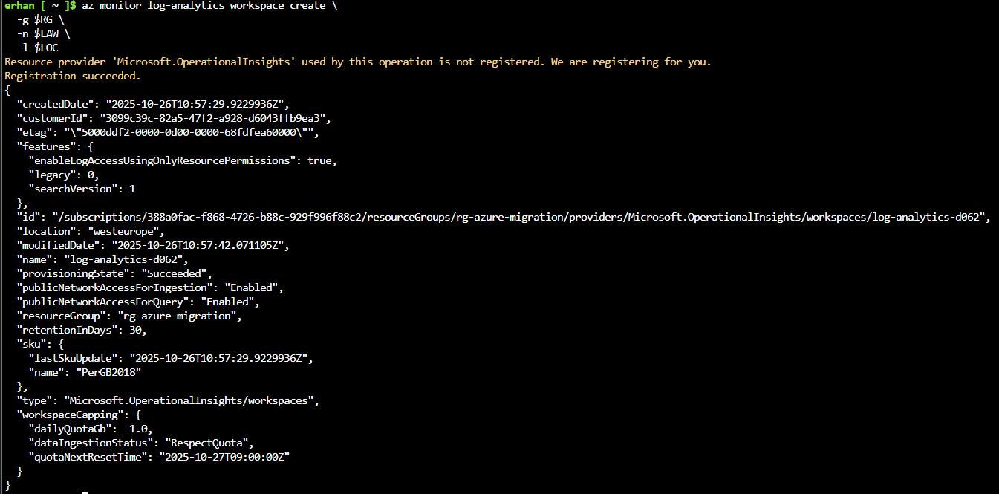

# Monitoring and Alerts

## Objective
In this section, I will:
- Create a dedicated monitoring resource group.
- Deploy a Log Analytics Workspace (LAW).
- Attempt to enable VM diagnostic settings to LAW (expected to fail because of tagging policy).
- Verify that the policy enforcement blocks non-compliant resources.
- Create a CPU alert rule on the VM.

This demonstrates both **governance** (policy enforcement) and **monitoring** (alerting) capabilities in Azure.

---

## 1️.Create a monitoring resource group and Log Analytics Workspace

I start by creating a new resource group for centralized monitoring, then deploy a Log Analytics Workspace.

```bash
RG="rg-azure-migration"
LOC="westeurope"
LAW="log-analytics-$(openssl rand -hex 2)"

az group create \
  -n $RG \
  -l $LOC

az monitor log-analytics workspace create \
  -g $RG \
  -n $LAW \
  -l $LOC
```
Result:

- Resource Group: rg-azure-migration
- Location: westeurope
- Workspace created with a unique name for global uniqueness.





## 2️.Attempt to connect VM diagnostics to LAW (Expected to FAIL)

Next, I attempt to enable diagnostic settings on the VM vm-cli-01 to send metrics and logs to the newly created workspace.

```bash
SUB_ID=$(az account show --query id -o tsv)
VMRG="vm-cli-rg"
VMNAME="vm-cli-01"

az provider register --namespace Microsoft.Insights

az monitor diagnostic-settings create \
  --resource "/subscriptions/${SUB_ID}/resourceGroups/${VMRG}/providers/Microsoft.Compute/virtualMachines/${VMNAME}" \
  --name sendToLAW \
  --workspace $(az monitor log-analytics workspace show -g $RG -n $LAW --query id -o tsv) \
  --metrics '[{"category": "AllMetrics", "enabled": true}]' \
  --logs    '[{"category": "Administrative", "enabled": true}]'
```
Result:

The command fails with a Policy Deny error because the required tag (e.g., Environment) is missing on the target resource.
This is an intentional block caused by the tag enforcement policy applied at the vm-cli-rg scope.


## 3️.Verify Policy Enforcement

I list policy assignments to show which policies are applied at the vm-cli-rg scope.

```bash
az policy assignment list \
  --scope /subscriptions/${SUB_ID}/resourceGroups/${VMRG} \
  -o table
```

Observation:
The “Enforce tagging policy (vm-cli-rg)” prevents creation of diagnostic settings without the required tags.
This is an excellent example of how Azure Policy enforces compliance automatically.


## 4️.Create a CPU Alert Rule

Now that monitoring is in place, we configure an alert rule to monitor CPU usage on vm-cli-01.

```bash
az monitor metrics alert create \
  -g $RG \
  -n "HighCPUAlert" \
  --scopes "/subscriptions/${SUB_ID}/resourceGroups/${VMRG}/providers/Microsoft.Compute/virtualMachines/${VMNAME}" \
  --condition "avg Percentage CPU > 80" \
  --description "Alert when CPU > 80%" \
  --severity 2
```
Result:

- Alert Name: HighCPUAlert
- Condition: Average CPU > 80%
- Severity: 2 (Warning)
- Target: vm-cli-01

This alert will trigger whenever the VM’s CPU utilization crosses the defined threshold.


