# 10 - Containerization and Azure PaaS Deployment

## Overview
In this part of my case study, I demonstrate how I built, containerized, and deployed a lightweight Flask web application using **Azure Container Registry (ACR)** and **Azure Container Instances (ACI)**.  
This process highlights the end-to-end workflow of building, storing, and running containerized applications in Azure.

- Containerized the Flask application using Docker.  
- Published the image to **Azure Container Registry (ACR)** for secure, private storage.  
- Deployed the container to **Azure Container Instances (ACI)** for a fully managed runtime.  
- Verified successful deployment using both the **Azure CLI** and the **Azure Portal**.  

This exercise demonstrates how I apply **modern DevOps and PaaS practices** to transform traditional workloads into containerized, cloud-native solutions in Azure.

---

## 1: Build and Containerize the Application

I started with a lightweight Flask app located under:

**app.py**
```python
from flask import Flask
import os

app = Flask(__name__)

@app.route("/")
def home():
    return f"Hello from Azure Container Instances! Host: {os.getenv('HOSTNAME')}"

if __name__ == "__main__":
    app.run(host="0.0.0.0", port=80)
```
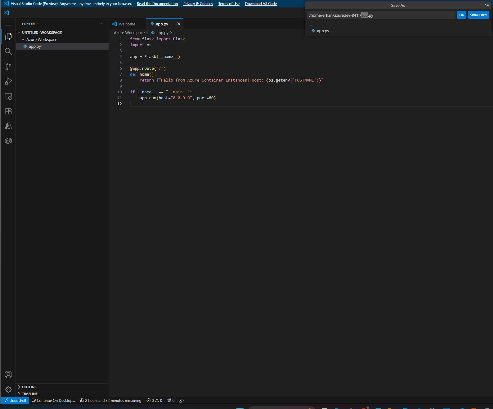

## 2.Dockerfile
  
```dockerfile
FROM python:3.9-slim
WORKDIR /app
COPY app.py .
RUN pip install flask
EXPOSE 80
CMD ["python", "app.py"]
```

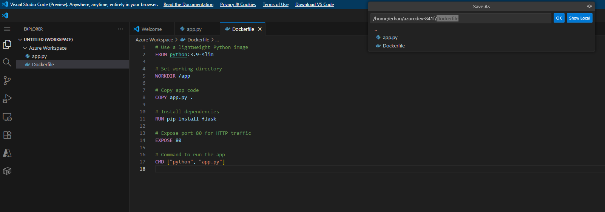

## 3. Configure environment variables before pushing the image

This step defines the key variables used throughout the container deployment — such as the resource group, registry name, and location.

```bash
# Example variable setup
RG="rg-container-demo"
ACR_NAME="myacr7406"
LOCATION="eastus"
```


## 4. Create Resource Group and Azure Container Registry (ACR)

Once the variables are set, I created a resource group and a private Azure Container Registry using the following commands:

```bash
# Create resource group
az group create --name $RG --location $LOCATION

# Create Azure Container Registry (Basic SKU = cheapest tier)
az acr create --resource-group $RG --name $ACR_NAME --sku Basic
```

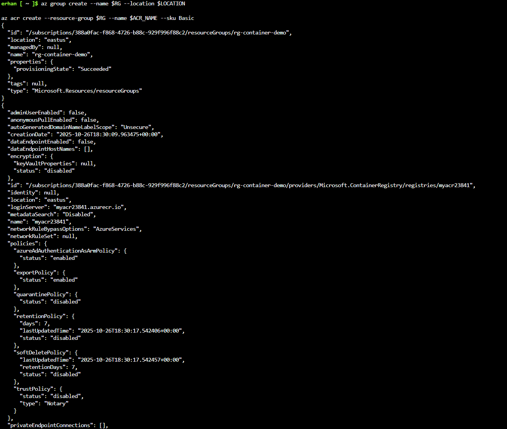
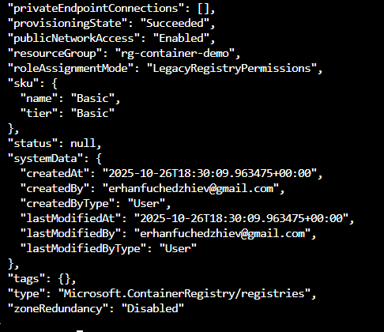

## 5. Get ACR Info

To confirm that my Azure Container Registry was created correctly, I retrieved the registry’s login server address using the command below.

```bash
# Display ACR login server and verify configuration
az acr show --name $ACR_NAME --query loginServer --output table
```


## 6. Create project folder in PowerShell

I created a dedicated folder to store my Flask app and Dockerfile.  
This helps keep the container project organized and ready for build and deployment.

```bash
# Create project directory and navigate into it
mkdir 06-data-platform-and-integration/01-containers-and-orchestration/containerized-sample-app
cd 06-data-platform-and-integration/01-containers-and-orchestration/containerized-sample-app
```
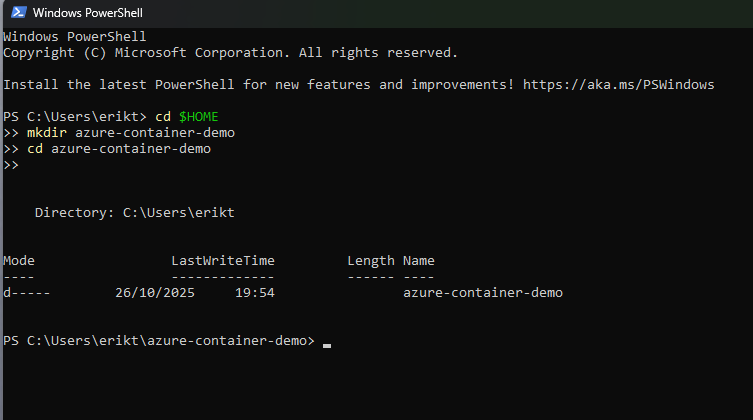

## 7. Create Flask application

Inside the project folder, I created the `app.py` file — a simple Flask web application that returns the container host name.  
This app will later be packaged inside the Docker image.

```python
# app.py
from flask import Flask
import os

app = Flask(__name__)

@app.route("/")
def home():
    return f"Hello from Azure Container Instances! Host: {os.getenv('HOSTNAME')}"

if __name__ == "__main__":
    app.run(host="0.0.0.0", port=80)
```


## 8. Create Dockerfile

After creating the Flask app, I added a `Dockerfile` in the same directory.  
This file defines how the image is built and what dependencies are included.

```dockerfile
# Use a lightweight Python base image
FROM python:3.9-slim

# Set working directory
WORKDIR /app

# Copy app files
COPY app.py .

# Install dependencies
RUN pip install flask

# Expose port 80 for web traffic
EXPOSE 80

# Start the Flask app
CMD ["python", "app.py"]
```

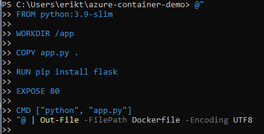

## 9. Verify project files

After creating both the Flask application and the Dockerfile, I verified that both files existed in the project directory.

```bash
# List files in the current directory
ls
```
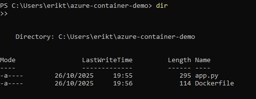

This confirmed that the folder was correctly set up and ready for building the Docker image.

## 10. Build the Docker image

With the application and Dockerfile ready, I built the Docker image locally to confirm that it compiles successfully.

```bash
# Build the Docker image
docker build -t azure-demo-app:v1 .
```


Once the build completed, Docker output showed that all layers were created and the image was successfully tagged as azure-demo-app:v1.

## 11. Run the container locally

After building the image, I ran the container locally to test the Flask application and verify that it worked as expected.

```bash
# Run the container on port 8080
docker run -p 8080:80 azure-demo-app:v1
```


This command maps the container’s port 80 to 8080 on my local machine, allowing me to access the app in a browser.

## 12. Check running containers

To confirm that the container was up and running, I listed all active containers using the command below.

```bash
# List all running containers
docker ps
```


The output showed the azure-demo-app:v1 image with port mapping 0.0.0.0:8080->80/tcp, confirming that it was running correctly.

## 13. Test the application in a browser

After confirming that the container was running, I opened the app in my web browser at [http://localhost:8080](http://localhost:8080).

The application returned the expected message:Hello from Azure Container Instances! Host: <container-hostname>


## 14. Tag the local image for Azure Container Registry

Before pushing the image to Azure, I tagged the local Docker image with the Azure Container Registry (ACR) login server name.

```bash
# Retrieve ACR login server
LOGIN_SERVER=$(az acr show --name $ACR_NAME --query loginServer --output tsv)

# Tag the local image for ACR
docker tag azure-demo-app:v1 $LOGIN_SERVER/azure-demo-app:v1
```


This ensures that the image is properly associated with my private ACR repository before uploading.

## 15. Push the image to Azure Container Registry

After tagging the image, I pushed it to my Azure Container Registry (ACR) so it could be used by Azure Container Instances (ACI).

```bash
# Push the image to ACR
docker push $LOGIN_SERVER/azure-demo-app:v1
```


This command uploads all image layers to ACR. Once complete, the image becomes available for deployment in Azure.

## 16. Confirm image tagging for Azure

After pushing the image, I verified that the local and ACR-tagged images both existed and shared the same image ID.  
This confirmed that the tagging process was successful.

```bash
# List all Docker images
docker images
```
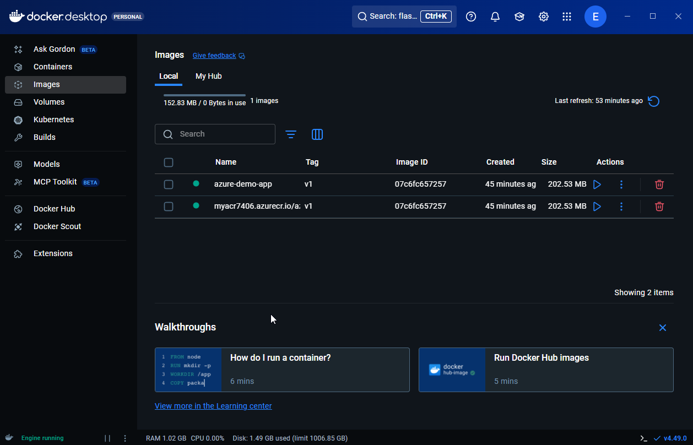

The output showed two entries:

- azure-demo-app:v1
- $LOGIN_SERVER/azure-demo-app:v1

Both with the same image ID, confirming the tag worked correctly.

## 17. Confirm image pushed successfully to Azure

Once the push completed, I verified that the image was successfully stored in Azure Container Registry (ACR).

```bash
# List all repositories in ACR
az acr repository list --name $ACR_NAME --output table

# Check available tags for the repository
az acr repository show-tags --name $ACR_NAME --repository azure-demo-app --output table
```
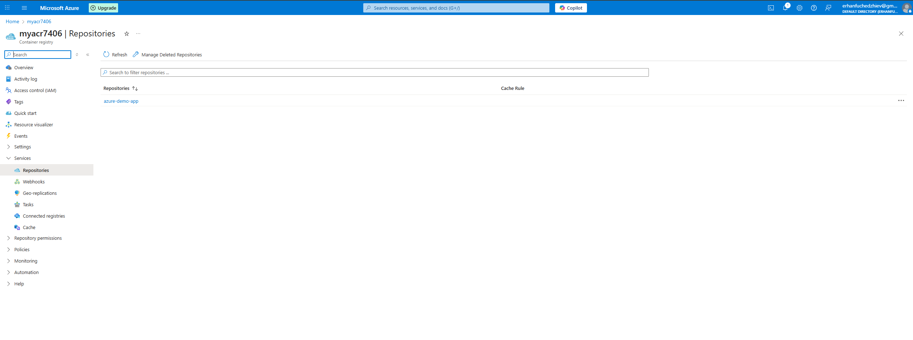

The output confirmed the repository azure-demo-app with the tag v1, showing that the image was uploaded successfully and is now ready for deployment.

## 18. Create Azure Container Instance (ACI)

After verifying the image in ACR, I deployed it to Azure Container Instances (ACI) — a fully managed environment for running containers without virtual machines.

```bash
# Retrieve ACR credentials
ACR_USERNAME=$(az acr credential show --name $ACR_NAME --query username -o tsv)
ACR_PASSWORD=$(az acr credential show --name $ACR_NAME --query "passwords[0].value" -o tsv)

# Create container instance
az container create \
  --resource-group $RG \
  --name demo-container \
  --image $LOGIN_SERVER/azure-demo-app:v1 \
  --cpu 1 \
  --memory 1 \
  --registry-login-server $LOGIN_SERVER \
  --registry-username $ACR_USERNAME \
  --registry-password $ACR_PASSWORD \
  --dns-name-label demo-container-$RANDOM \
  --ports 80
```
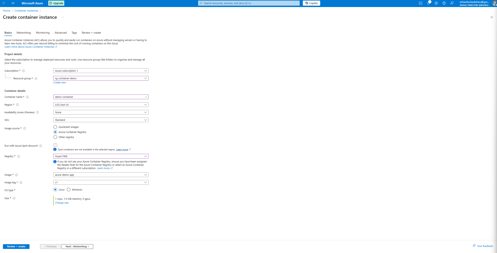
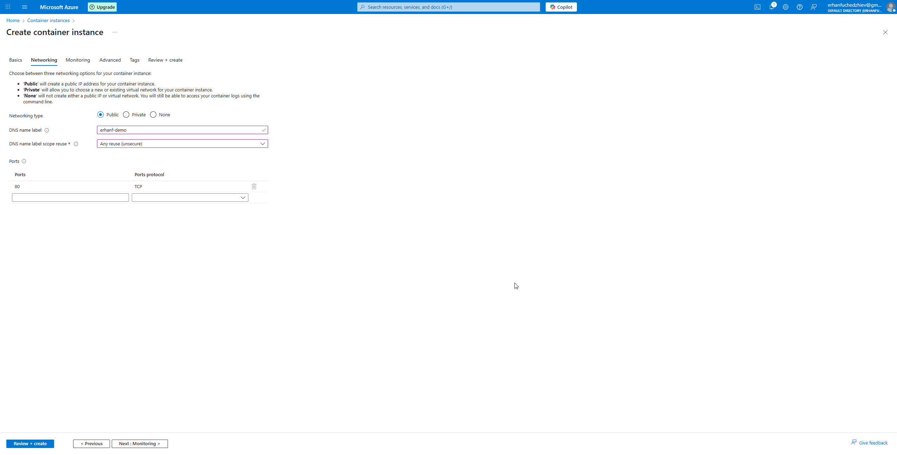
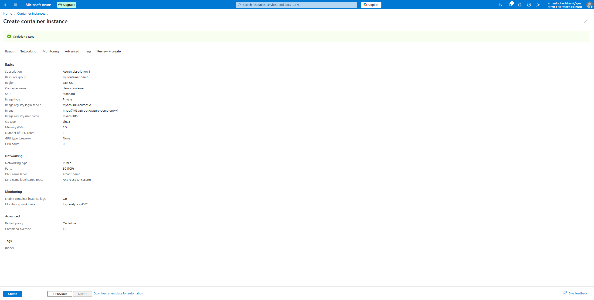

This command deploys the container directly from ACR, assigning it a public DNS name for access.

## 21. Container deployment complete

After passing validation, the Azure Container Instance (ACI) deployment completed successfully.  
The output confirmed that the container was created and is now running in Azure.

```bash
# Check container deployment status
az container show \
  --resource-group $RG \
  --name demo-container \
  --query "{FQDN:ipAddress.fqdn, State:instanceView.state}" \
  --output table
```
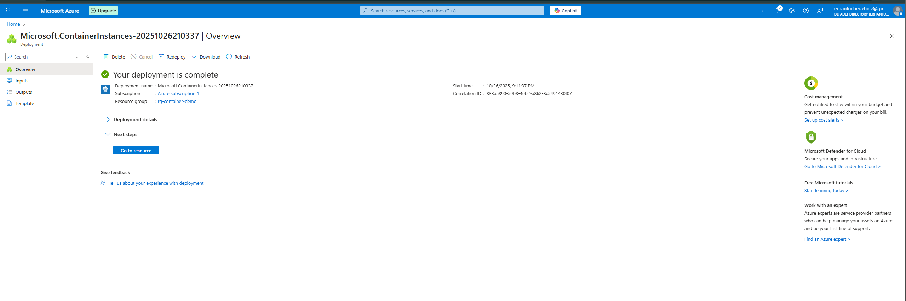

## 22. Confirm container instance in Azure Portal

After the deployment finished, I verified the container instance directly in the Azure Portal.  
The container appeared under the correct resource group with its assigned DNS name and running state.

```bash
# Optional check from CLI
az container list --resource-group $RG --output table
```


This confirmed that the deployment was successful and visible through both the Azure CLI and the Azure Portal interface.

## 23. View the running app in a browser

Finally, I accessed the containerized Flask application using its public Azure DNS address returned from the deployment output.

```bash
# Retrieve the container's public FQDN
az container show \
  --resource-group $RG \
  --name demo-container \
  --query ipAddress.fqdn \
  --output tsv
```
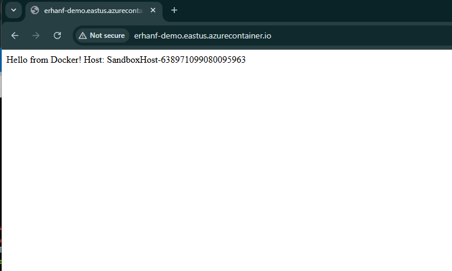


