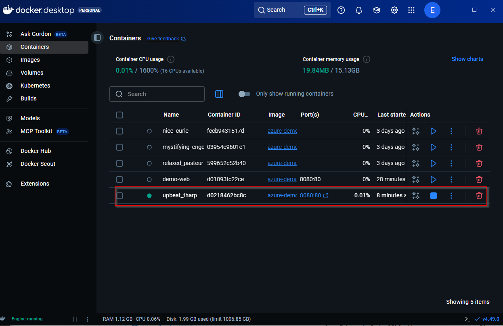

# 11 — Secure Database Integration with Azure Key Vault and Container Instances

## Overview

In this stage of the Azure VM migration case study, the focus shifts from simple container deployment to **secure integration with a managed PostgreSQL database** using **Azure Key Vault**.

This step demonstrates how to:
- Store database credentials securely in Key Vault  
- Inject secrets dynamically into an Azure Container Instance (ACI)  
- Connect a Flask application container to Azure PostgreSQL Flexible Server  
- Validate successful data persistence and secure runtime configuration  

---

## Objectives

| # | Objective | Description |
|--|-------------|--------------|
| 1 | **Provision a database** | Create Azure PostgreSQL Flexible Server as a managed PaaS database |
| 2 | **Secure credentials** | Store the DB connection string securely in Azure Key Vault |
| 3 | **Restrict network access** | Configure firewall and private endpoint for database |
| 4 | **Deploy container** | Run a Flask app container that interacts with the database |
| 5 | **Inject secret from Key Vault** | Dynamically pass the DB connection string to the container |
| 6 | **Validate** | Confirm the application writes data successfully to PostgreSQL |

---

## Step 1 — Create PostgreSQL Flexible Server

The PostgreSQL Flexible Server provides a fully managed, scalable relational database that the application will use for persistent data storage.

**Script:**  
[`15-create-postgres-flexibleserver.sh`](../scripts/15-create-postgres-flexibleserver.sh)

**Screenshot reference:**  


This script provisions the PostgreSQL server with admin credentials, a demo database, and basic network configuration.

---

## Step 2 — Set up Key Vault and Store Secret

To avoid hardcoding connection strings, the application retrieves its credentials from **Azure Key Vault** at runtime.

**Script:**  
[`16-setup-keyvault-and-secret.sh`](../scripts/16-setup-keyvault-and-secret.sh)

**Screenshot references:**  
-   
- 

The script performs:
1. Creation of a Key Vault resource  
2. Retrieval of the PostgreSQL connection string  
3. Storage of the connection string as a Key Vault secret named `DBConnectionString`

---

## Step 3 — Secure PostgreSQL Network

The database is configured to **allow access only from trusted Azure resources** or a private VNet subnet.

**Script:**  
[`17-secure-postgres-network.sh`](../scripts/17-secure-postgres-network.sh)

**Screenshot references:**  
-   
- 

This step ensures that the database cannot be accessed publicly and that only the containerized app inside Azure can communicate with it.

---

## Step 4 — Deploy the Containerized Application

The Flask app image (`azure-demo-app:v1`) was pushed to Azure Container Registry earlier.  
Now we deploy it as a container instance that connects to the PostgreSQL server.

**Script:**  
[`18-deploy-db-backed-container.sh`](../scripts/18-deploy-db-backed-container.sh)

**Screenshot references:**  
-   
- 

This script:
- Pulls the image from ACR  
- Deploys the container  
- Exposes port 80 publicly for validation  
- Prepares the container environment for secret injection

---

## Step 5 — Inject the Secret from Key Vault into the Container

This is the most critical security step.  
Instead of embedding credentials in code, the container retrieves the database connection string securely from Azure Key Vault during deployment.

**Script:**  
[`19-inject-secret-from-keyvault-into-container.sh`](../scripts/19-inject-secret-from-keyvault-into-container.sh)

**Screenshot references:**  
-   
-   
- 

Key command used:
```bash
az container create \
  --resource-group rg-container-demo \
  --name demo-container \
  --image myacr7406.azurecr.io/azure-demo-app:v1 \
  --registry-login-server myacr7406.azurecr.io \
  --registry-username $ACR_USERNAME \
  --registry-password $ACR_PASSWORD \
  --environment-variables DB_CONN=$(az keyvault secret show \
        --vault-name demo-kv \
        --name DBConnectionString \
        --query value -o tsv) \
  --ports 80 \
  --os-type Linux \
  --location eastus
```
