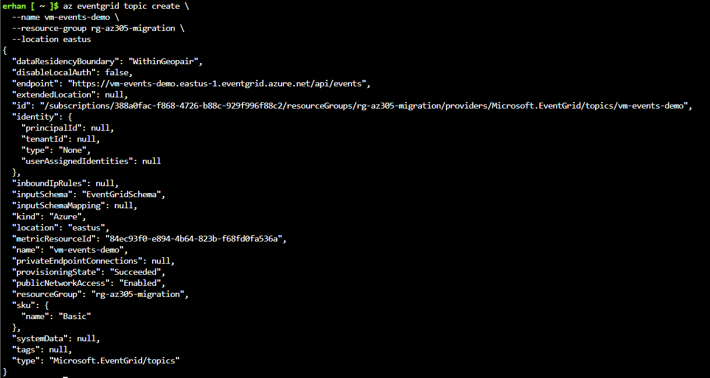

# 12-Integration, Event-Driven Messaging & Hybrid Connectivity

## Purpose  
As part of the VM migration to Azure, I must ensure that the workload integrates cleanly with downstream systems while supporting hybrid connectivity and future modernization.  
This section details how we implemented an event-driven integration pattern using Azure native services.

## Architecture Vision  
- Use event-driven architecture: the migrated VM emits events rather than exposing direct file shares or polling.  
- Employ hybrid connectivity between on-premises workload and Azure landing zone.  
- Decouple legacy workloads from downstream systems enabling future evolution to PaaS/serverless.  
- Maintain governance, schema discipline, and observable operations.

---

## 1.Implementation  

### 1. Create Resource Group  
A dedicated resource group (`rg-az305-migration`) was created to logically isolate all migration and integration resources.

```bash
az group create \
  --name rg-az305-migration \
  --location eastus
```


## 2. Create Event Grid Topic

I provisioned an Azure Event Grid Topic named vm-events-demo to handle integration events from the migrated VM.
```bash
az eventgrid topic create \
  --name vm-events-demo \
  --resource-group rg-az305-migration \
  --location eastus
```



Key details:

- Schema: EventGridSchema
- Public network access: Enabled
- Provisioning state: Succeeded


## 3. Retrieve Topic Resource ID

After creation, I retrieved the resource ID of the topic for event publishing and subscription creation.
```bash
az eventgrid topic show \
  --name vm-events-demo \
  --resource-group rg-az305-migration \
  --query id \
  --output tsv
```


## 4. Publish Test Event

To validate the event-driven integration, we published a test event representing a VM export job completion.
Initially, we used the CloudEvent schema and received an expected error because our topic was configured for EventGridSchema.
I then adjusted the payload accordingly.

```bash
curl -X POST \
  -H "aeg-sas-key: $EVENTGRID_KEY" \
  -H "Content-Type: application/json; charset=utf-8" \
  --data '[
    {
      "id": "12345",
      "eventType": "FileReady",
      "subject": "vm/job",
      "eventTime": "2025-10-29T15:20:00Z",
      "data": {
        "filename": "daily_export.csv"
      },
      "dataVersion": "1.0"
    }
  ]' \
  "https://vm-events-demo.eastus-1.eventgrid.azure.net/api/events"
```


Result: HTTP 202 Accepted — the event was successfully received by Event Grid.

## 5. Verify in Azure Portal
In the Azure Portal, navigate to:

Event Grid → Topics → vm-events-demo → Overview / Metrics

Here I verified that the topic was active and ready for subscriptions.
Metrics confirmed a successful event publish operation.


This script registers a webhook subscriber pointing to the public Event Grid Viewer to visualize incoming events:
- https://eventgridviewer.azurewebsites.net


  
