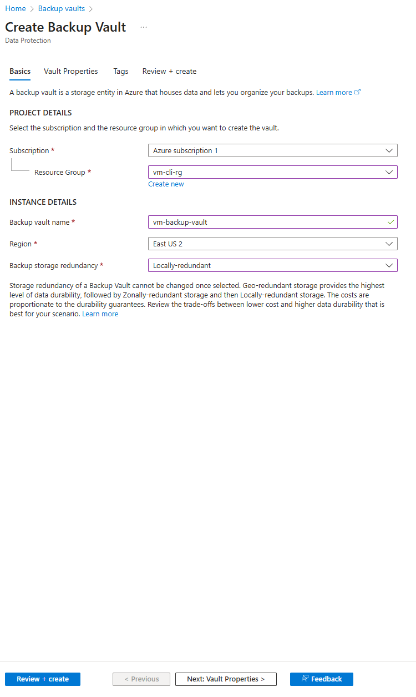

# Exercise: Create a Backup for an Azure VM (Portal & CLI)

## Objective
This exercise demonstrates two methods to **create and configure a backup for a Windows Server 2022 Virtual Machine** — first using the **Azure Portal**, and then via **Azure CLI automation**.

It complements the earlier “Create Azure VM using CLI” case study in this repository.

---

## Prerequisites
- Active [Azure subscription](https://portal.azure.com)
- Existing VM created (e.g., `vm-cli-rg`)
- Access to [Azure Cloud Shell](https://shell.azure.com) or the Azure CLI installed locally
- Resource group and region must match your VM deployment

---

## Method 1 — Create Backup via Azure Portal

1. In the Azure Portal, search for **Backup Vaults**.  
2. Click **Create** → fill in the following:
   - **Subscription:** Azure subscription 1  
   - **Resource Group:** `vm-cli-rg`  
   - **Backup Vault name:** `vm-backup-vault`  
   - **Region:** East US 2  
   - **Backup storage redundancy:** Locally-redundant  
3. Enable system identity and leave other settings default.  
4. Click **Review + Create** → **Create**.

---

### 📸 Screenshot — Create Backup Vault in Azure Portal
The screenshot below demonstrates how to **create the backup vault** in the Azure Portal.



---

## Method 2 — Create Backup via Azure CLI

To automate the backup configuration, use the following Bash script.  
Save it as `backup-azure-vm-cli.sh` in your `/scripts` folder and run it in **Azure Cloud Shell**.

```bash
#!/usr/bin/env bash
set -euo pipefail

# ===========================
# Azure VM Backup – One-shot
# Using Recovery Services vault (az backup)
# ===========================

# --------- Variables ----------
RG="vm-cli-rg"
LOC="eastus2"
VAULT="vm-backup-vault"
VMNAME="vm-cli-rg"        # your actual VM name
VAULT_REDUNDANCY="LocallyRedundant"  # or GeoRedundant / ZoneRedundant
RETAIN_DAYS=30
# ------------------------------

log()   { echo -e "\n==> $*"; }
die()   { echo "ERROR: $*" >&2; exit 1; }

# Validate CLI
command -v az >/dev/null || die "Azure CLI (az) not found. Please install Azure CLI."

# Show subscription info
log "Using subscription:"
az account show --query "{Name:name, Id:id, IsDefault:isDefault}" -o table || die "Not logged in. Run: az login"

# 1) Ensure resource group exists
log "Ensuring resource group '$RG' in region '$LOC'..."
az group create -n "$RG" -l "$LOC" -o table >/dev/null

# 2) Create (or ensure) Recovery Services vault
log "Creating (or reusing) Recovery Services vault: $VAULT"
az backup vault create \
  --resource-group "$RG" \
  --name "$VAULT" \
  --location "$LOC" -o table >/dev/null || true

# 3) Configure vault redundancy
log "Setting vault storage redundancy to: $VAULT_REDUNDANCY"
az backup vault backup-properties set \
  --resource-group "$RG" \
  --name "$VAULT" \
  --backup-storage-redundancy "$VAULT_REDUNDANCY" -o table

# 4) Find the VM ID
log "Checking VM '$VMNAME'..."
VM_ID=$(az vm show -g "$RG" -n "$VMNAME" --query id -o tsv 2>/dev/null || true)
[[ -n "$VM_ID" ]] || die "VM '$VMNAME' not found in resource group '$RG'."

# 5) Enable protection using DefaultPolicy
POLICY_NAME="DefaultPolicy"
log "Enabling backup protection for VM '$VMNAME' using policy '$POLICY_NAME'..."
az backup protection enable-for-vm \
  --resource-group "$RG" \
  --vault-name "$VAULT" \
  --vm "$VMNAME" \
  --policy-name "$POLICY_NAME" -o table

# 6) Find container & item names
log "Resolving backup container and item..."
CONTAINER_NAME=$(az backup container list \
  --resource-group "$RG" \
  --vault-name "$VAULT" \
  --backup-management-type AzureIaasVM \
  --query "[?contains(friendlyName, '${VMNAME}')].name | [0]" -o tsv)

[[ -n "$CONTAINER_NAME" ]] || die "Could not resolve backup container for VM '$VMNAME'."

ITEM_NAME=$(az backup item list \
  --resource-group "$RG" \
  --vault-name "$VAULT" \
  --container-name "$CONTAINER_NAME" \
  --backup-management-type AzureIaasVM \
  --query "[0].name" -o tsv)

[[ -n "$ITEM_NAME" ]] || die "Could not resolve backup item for VM '$VMNAME'."

# 7) Trigger an on-demand backup
RETAIN_UNTIL=$(date -u -d "+${RETAIN_DAYS} days" '+%Y-%m-%dT%H:%M:%SZ' 2>/dev/null || date -u -v+${RETAIN_DAYS}d '+%Y-%m-%dT%H:%M:%SZ')

log "Triggering on-demand backup (retain until $RETAIN_UNTIL)..."
az backup protection backup-now \
  --resource-group "$RG" \
  --vault-name "$VAULT" \
  --container-name "$CONTAINER_NAME" \
  --item-name "$ITEM_NAME" \
  --backup-management-type AzureIaasVM \
  --retain-until "$RETAIN_UNTIL" -o table

# 8) Show recent backup job status
log "Latest backup job for '$VMNAME':"
az backup job list \
  --resource-group "$RG" \
  --vault-name "$VAULT" \
  --query "[0].{Operation:operation, Status:status, Start:startTime, End:endTime}" -o table

log "✅ Backup completed successfully!"
echo
echo "You can verify in the Azure Portal under:"
echo "Recovery Services vaults → $VAULT → Backup items → Azure Virtual Machine → $VMNAME"
