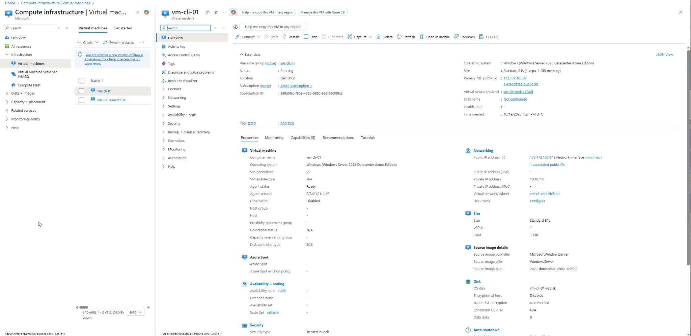

# Exercise: Create a Virtual Machine using Azure CLI

## Objective
This exercise demonstrates how to **create and configure a Windows Server 2022 Virtual Machine using Azure CLI**.  
It serves as an alternative method to deploying via the Azure Portal, forming part of the Research Company’s Azure migration case study.

---

## Prerequisites
- Active [Azure free trial](https://azure.microsoft.com/free/)
- Access to the [Azure Cloud Shell](https://shell.azure.com) or Azure CLI installed locally  
- Basic understanding of networking and resource groups in Azure  

---

## Step-by-Step Implementation

### Step 1 — Launch Azure Cloud Shell
1. Sign in to the [Azure Portal](https://portal.azure.com).  
2. Click the **Cloud Shell** icon in the top navigation bar.  
3. Select **Bash** as your environment.

---

### Step 2 — Create and Run the Script
Create a new file named **`create-azure-vm-cli.sh`** and paste the following code:

```bash
#!/usr/bin/env bash
set -euo pipefail

# ========= Variables you can tweak =========
RG="vm-cli-rg"
LOC="eastus2"
VMNAME="vm-cli-01"
VNET="vm-cli-vnet"
SUBNET="default"
NSG="vm-cli-nsg"
PIP="vm-cli-ip"
NIC="vm-cli-nic"
ADDR_PREFIX="10.10.0.0/16"
SUBNET_PREFIX="10.10.1.0/24"
SIZE="Standard_B1s"
ADMIN="azureuser"
IMAGE="MicrosoftWindowsServer:WindowsServer:2022-datacenter-azure-edition:latest"
# ===========================================

MYIP="$(curl -s ifconfig.me || echo 0.0.0.0)"
if [[ "$MYIP" == "0.0.0.0" || -z "$MYIP" ]]; then
  SRC_PREFIX="*"
else
  SRC_PREFIX="${MYIP}/32"
fi

read -s -p "Enter a strong password for '${ADMIN}': " ADMINPW; echo

az group create -n "$RG" -l "$LOC" -o table
az network vnet create -g "$RG" -n "$VNET" --address-prefix "$ADDR_PREFIX" \
  --subnet-name "$SUBNET" --subnet-prefix "$SUBNET_PREFIX" -o table

az network nsg create -g "$RG" -n "$NSG" -o table
az network nsg rule create -g "$RG" --nsg-name "$NSG" -n allow-rdp \
  --priority 1000 --protocol Tcp --access Allow \
  --source-address-prefixes "$SRC_PREFIX" \
  --destination-port-ranges 3389 -o table

az network public-ip create -g "$RG" -n "$PIP" --sku Standard -o table
az network nic create -g "$RG" -n "$NIC" --vnet-name "$VNET" --subnet "$SUBNET" \
  --network-security-group "$NSG" --public-ip-address "$PIP" -o table

az vm create -g "$RG" -n "$VMNAME" --image "$IMAGE" --size "$SIZE" \
  --admin-username "$ADMIN" --admin-password "$ADMINPW" --nics "$NIC" \
  --os-disk-name "${VMNAME}-osdisk" --public-ip-sku Standard --license-type Windows_Server -o table

PUBLIC_IP="$(az vm show -d -g "$RG" -n "$VMNAME" --query publicIps -o tsv)"
echo ""
echo "================== Connection details =================="
echo "VM Name:     $VMNAME"
echo "Username:    $ADMIN"
echo "Public IP:   $PUBLIC_IP"
echo "RDP:         ${PUBLIC_IP}:3389 (allowed from ${SRC_PREFIX})"
echo "========================================================"
```

## Outcome
You have successfully **created and configured a Windows Server 2022 Virtual Machine using Azure CLI**.  
This approach demonstrates automation and scripting best practices, complementing the Azure Portal-based deployment.

---

## Verification Screenshot
The screenshot below shows the **deployed VM (vm-cli-01)** in the Azure Portal, confirming a successful deployment.



---

## Comparison: Azure Portal vs Azure CLI

| Feature | Azure Portal | Azure CLI |
|----------|---------------|-----------|
| Ease of use | GUI-based, beginner-friendly | Command-line, ideal for automation |
| Speed | Manual configuration | Faster, scriptable |
| Repeatability | Limited | Easily repeatable |
| Ideal for | Learning, small deployments | Automation, DevOps, CI/CD |


